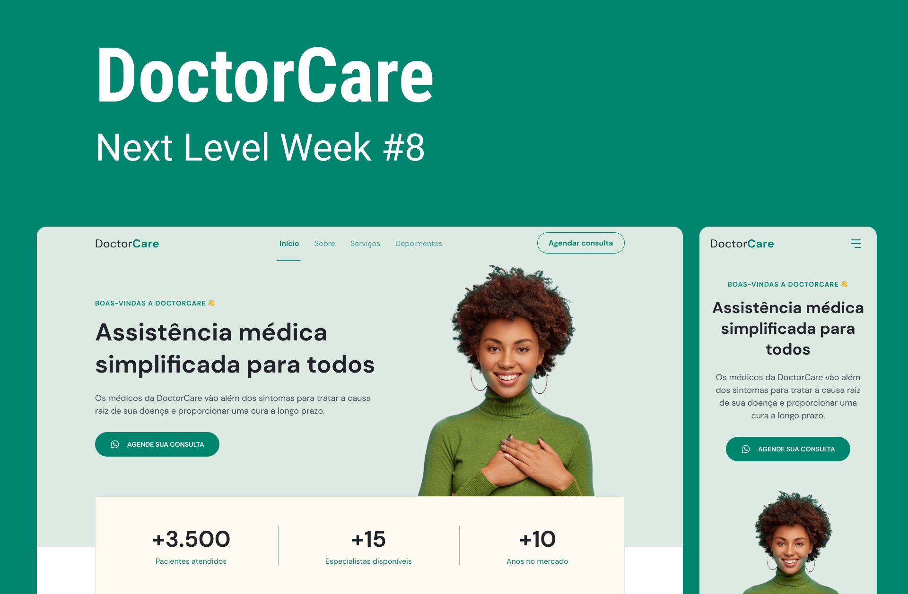

## Visualização

<h1 align="center">

</h1>

## 💻 Projeto

O Doctor Care foi realizado no evento Next Level Week Return, organizado pela Rocketseat. Na trilha Origin, tive a oportunidade de desenvolver esse projeto, que explorou algumas ferramentas do JavaScript, além de HTML e CSS. Para dar responsividade, utilizei o Media Queries.

## 🧬 Tecnologias
Este projeto foi desenvolvido utilizando as seguintes tecnologias:
* HTML;
* CSS;
* JavaScript;
* Scroll Reveal (biblioteca).

## 💾 Baixar o projeto
Faça o clone do repositório para ter uma versão do projeto em sua máquina: 
`$ git clone https://github.com/mmanaclara/nlw-8.git` 

## 📝 Licença
Este projeto está licenciado nos termos da licença [MIT](https://github.com/mmanaclara/nlw-8/blob/main/LICENSE.md). 